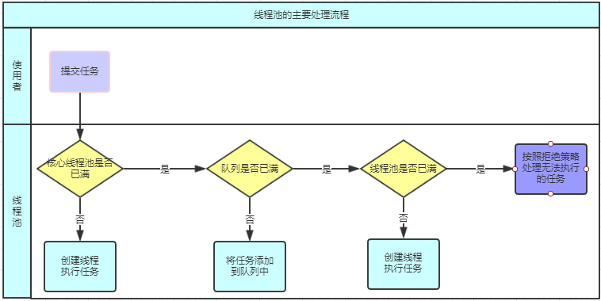

# Java并发编程

## 1 多线程基础

### 1.1 进程vs线程vs协程

- 线程是比进程更小的执行单位，一个进程在其执行过程中可以产生多个线程

- 同一个进程的多个线程共享进程的**堆**和**方法区**资源，而每个线程有自己的**程序计数器**、**虚拟机栈**和**本地方法栈**

- 总体上来说线程是更轻量级的进程

  - 为什么协程是更轻量级的线程

  线程切换需要借助内核完成，意味着一次用户态到内核态的切换，以及一次内核态到用户态的切换
  
  而协程的切换至在用户态就可以完成，无需借助内核
  
### 1.2  线程的生命周期和状态

这6种状态定义在Thread类的State枚举中

- 新建（New）：已经创建好了线程对象，还没调用start()启动的线程处于这种状态

- 运行（Runnable）：包括操作系统线程状态中的**Running**和**Ready**，也就是出于此状态的线程有可能正在执行，也有可能正在等待CPU为它分配执行时间

- 无限期等待（Waiting）：处于这种状态的线程不会被分配CPU执行时间，它们要等待被其他线程显式唤醒。以下方法会让线程进入无限期等待的状态：

  - 没有设置timeout参数的Object.wait()方法

  - 没有设置timeout参数的Thread,join()方法

  - LockSupport.park()方法

- 限期等待（Timed Waiting）：处于这种状态的线程也不会被分配CPU执行时间，不过无需等待被其他线程显式唤醒，在一定时间后它们会由操作系统自动唤醒。以下方法会让线程进入限期等待的状态：

  - Thread,sleep()方法
  - 设置了timeout参数的Object.wait()方法
  - 设置了timeout参数的Thread,join()方法
  - LockSupport.parkNanos()方法
  - LockSupport.parkUtil()方法

- 阻塞（Blocked）：线程被阻塞，“阻塞状态”与”等待状态“的区别：阻塞状态在等待着获取到一个排它锁，这个时间将在另一个线程放弃这个锁的时候发生。在程序等待进入同步区域（synchronized）的时候，线程将进入这种状态。

- 结束（Terminated）：已终止的线程状态，线程已经结束执行。

  ```java
  /**
       * A thread state.  A thread can be in one of the following states:
       * <ul>
       * <li>{@link #NEW}<br>
       *     A thread that has not yet started is in this state.
       *     </li>
       * <li>{@link #RUNNABLE}<br>
       *     A thread executing in the Java virtual machine is in this state.
       *     </li>
       * <li>{@link #BLOCKED}<br>
       *     A thread that is blocked waiting for a monitor lock
       *     is in this state.
       *     </li>
       * <li>{@link #WAITING}<br>
       *     A thread that is waiting indefinitely for another thread to
       *     perform a particular action is in this state.
       *     </li>
       * <li>{@link #TIMED_WAITING}<br>
       *     A thread that is waiting for another thread to perform an action
       *     for up to a specified waiting time is in this state.
       *     </li>
       * <li>{@link #TERMINATED}<br>
       *     A thread that has exited is in this state.
       *     </li>
       * </ul>
       *
       * <p>
       * A thread can be in only one state at a given point in time.
       * These states are virtual machine states which do not reflect
       * any operating system thread states.
       *
       * @since   1.5
       * @see #getState
       */
      public enum State {
          /**
           * Thread state for a thread which has not yet started.
           */
          NEW,
  
          /**
           * Thread state for a runnable thread.  A thread in the runnable
           * state is executing in the Java virtual machine but it may
           * be waiting for other resources from the operating system
           * such as processor.
           */
          RUNNABLE,
  
          /**
           * Thread state for a thread blocked waiting for a monitor lock.
           * A thread in the blocked state is waiting for a monitor lock
           * to enter a synchronized block/method or
           * reenter a synchronized block/method after calling
           * {@link Object#wait() Object.wait}.
           */
          BLOCKED,
  
          /**
           * Thread state for a waiting thread.
           * A thread is in the waiting state due to calling one of the
           * following methods:
           * <ul>
           *   <li>{@link Object#wait() Object.wait} with no timeout</li>
           *   <li>{@link #join() Thread.join} with no timeout</li>
           *   <li>{@link LockSupport#park() LockSupport.park}</li>
           * </ul>
           *
           * <p>A thread in the waiting state is waiting for another thread to
           * perform a particular action.
           *
           * For example, a thread that has called <tt>Object.wait()</tt>
           * on an object is waiting for another thread to call
           * <tt>Object.notify()</tt> or <tt>Object.notifyAll()</tt> on
           * that object. A thread that has called <tt>Thread.join()</tt>
           * is waiting for a specified thread to terminate.
           */
          WAITING,
  
          /**
           * Thread state for a waiting thread with a specified waiting time.
           * A thread is in the timed waiting state due to calling one of
           * the following methods with a specified positive waiting time:
           * <ul>
           *   <li>{@link #sleep Thread.sleep}</li>
           *   <li>{@link Object#wait(long) Object.wait} with timeout</li>
           *   <li>{@link #join(long) Thread.join} with timeout</li>
           *   <li>{@link LockSupport#parkNanos LockSupport.parkNanos}</li>
           *   <li>{@link LockSupport#parkUntil LockSupport.parkUntil}</li>
           * </ul>
           */
          TIMED_WAITING,
  
          /**
           * Thread state for a terminated thread.
           * The thread has completed execution.
           */
          TERMINATED;
      }
  ```

  


### 1.3 上下文切换

多线程编程中，一般线程的个数都大于CPU核心的个数，而一个CPU核心在任意时刻只能被一个线程使用，为了让这些线程都能得到有效执行，CPU采用的策略是为每个线程分配时间片并轮转。当一个线程的时间片用完的时候就会重新出于就绪状态让给其他线程使用，这个过程就属于一次上下文切换。

概括来说就是：当前任务在执行完CPU时间片切换到另一个任务之前会先保存自己的状态，以便下次再切换回这个任务，可以在加载这个任务的状态。任务从保存到再加载的过程就是一次上下文切换。

上下文切换通常是计算密集型的。

### 1.4 死锁

必备的四个条件：

- 互斥条件：该资源任一时刻只由一个线程占用

- 请求与保持条件：一个进程因请求资源而阻塞时，对已获得的资源保持不放

- 不剥夺资源：线程已获得的资源在未使用完之前不能被其他线程强行剥夺，只有自己使用完毕后释放资源

- 循环等待条件：若干线程之间形成一种头尾相接的循环等待资源关系

### 1.5 sleep() vs wait()

- 最主要区别：sleep没有释放锁，wait释放了锁

- 两者都可以暂停线程的执行

- wait通常被用于线程间交互/通信，sleep通常被用于暂停执行

- wait被调用后，线程不会自动苏醒，需要别的线程调用同一个对象上的notify()或者notifyAll()。sleep执行完成后线程会自动苏醒。或者使用wait(long timeout)超时后线程会自动苏醒

### 1.6 start() vs run()

概括来说，run方法就是类的一个普通方法，直接执行的话和普通方法没什么两样。

start不同，它首先做了创建线程等一系列工作，然后在新线程中执行run方法

## 2 Synchronized关键字

### 2.1 Synchronized关键字理解

Synchronized关键字解决的是多个线程之间访问资源的同步性问题，synchronized关键字可以保证被它修饰的方法或者代码块在任意时刻只有一个线程执行。

早期版本中，synchronized属于重量级锁，效率低下；java6之后官方从jvm层面对synchronized做了较大优化，现在锁效率已经很不错了。

### 2.2 Synchronized关键词用法

按照**加锁的对象**区分可以分为**对象锁**和**类锁**；按照**在代码中的位置**可以分为**方法形式**和**代码块形式**。

#### 2.2.1 对象锁

对象锁也可以称为实例锁，只有使用同一个实例的多个线程才会受到锁影响。多个线程分别调用多个实例不受影响。

对象锁有3中方式：

1. 锁住对象实体中的非静态变量

   ```java
   private Object lock = new Object();

   public void someFunction(){
     synchronized (lock){
       //do something
     }
   }
   ```

2. 锁住this对象

   ```java
   public void someFunction(){
     synchronized(this){
       //do something
     }
   }
   ```

3. 锁住对象的非静态方法

   ```java
   public synchronized void someFunction(){
     //do something
   }
   ```

#### 2.2.2 类锁

类锁是所有线程共享的锁，同一时刻，只能有一个线程使用加了锁的方法或类对象，不管是不是同一个实例。

1. 锁住类的静态变量

   ```java
   private static Object lock = new Object();
   
   public void someFunction(){
   	synchronized (lock){
       //do something
     }
   }
   ```

2. 锁住XXX.class对象

   ```java
   public void someFunction(){
     synchronized(XXX.class){
       //do something
     }
   }
   ```

3. 锁住类的静态变量

   ```java
   public synchronized static void someFunction(){
     //do something
   }
   ```


#### 2.2.3 其他
- Synchronized锁是可重入锁
- 无论方法正常执行完毕或者抛出异常，都会释放锁

#### 2.2.4 基于Synchronized关键词的单例模式

```java
public class Singleton{
  private volatile static Singleton uniqueInstance;
  
  private Singleton{
  }
  
  public static Singleton getInstance(){
    if(uniqueInstance == null){
      synchronized(Singleton.class){
        if(uniqueInstance == null){
          uniqueInstance = new Singleton();
        }
      }
    }
    return uniqueInstance;
  }
}
```
另外，需要注意uniqueInstance采用volatile关键词修饰是很有必要的。

uniqueInstance采用volatile关键字修饰是很有必要的。uniqueInstance = new Singleton();这段代码其实是分为3步执行：

1. 为uniqueInstance分配内存空间

2. 初始化uniqueInstance

3. 将uniqueInstance指向分配的内存地址

但是由于JVM具有指令重排的特性，执行顺序有可能变成1-3-2.指令重排在单线程环境下不会出现问题，但是在多线程环境下会导致一个线程获得还没有初始化的实例。例如线程T1执行了1和3，此时T2调用getInstance()发现uniqueInstance不为空，因此返回uniqueInstance，但此时uniqueInstance还未被初始化。

### 2.3 synchronized关键字的底层原理

- Synchronized加在代码块上

  JVM是通过**monitorenter**和**monitorexit**来控制锁的获取和释放。

  当执行**monitorenter**时，线程试图获取锁也就是monitor（monitor对象存在于每个Java对象的对象头中）的持有权。当计数器为0则可以成功获取，获取之后将锁计数器置为1。在执行完monitorexit指令后，将锁计数器设为0。

- Synchronized加在方法上

  JVM是通过**ACC_SYNCHRONIZED**标记来控制的。一个同步方法会在运行时常量池中的method_info结构体中存放ACC_SYNCHRONIZED标识符、当一个线程访问方法时，回去检查是否存在ACC_SYNCHRONIZED标识，如果存在，则首先要获得对应的monitor锁，然后执行方法。

### 2.4 Synchronized与ReentrantLock的比较

- 两者都是可重入锁

- Synchronized依赖于JVM而ReentrantLock依赖于API

  Synchronized依赖于JVM，更加简洁

  ReentrantLock依赖于API，需要lock()和unlock()配合tryfinally使用

- 性能已经不再是两者之间抉择的依据

- ReentrantLock多了一些高级功能，如公平锁、绑定多个Condition等


## 3 volatile关键字

### 3.1 Java内存模型（JMM)

概括来说就是：堆上的共享变量的读写操作必须在工作内存中进行。首先将内存变量从主内存拷贝到自己的工作内存空间，然后对变量进行操作，操作完再回写主内存。

### 3.2 volatile关键字的作用

#### 3.2.1 保证变量的可见性

如果变量被volatile修饰，那么每次访问的时候都会从主内存中读取其值。

#### 3.2.2 屏蔽指令重排序

编译器重排序是通过调整指令顺序，做到在不改变程序语义的前提下，**尽可能减少寄存器的读取、存取次数，充分复用寄存器的存储值**。
```java
int x = 10;
int y = 9;
x = x + 10;
```

分析一下上面的三行代码：

1. 加载x变量的内存地址到地址寄存器，加载10到数据寄存器，CPU使用mov命令把10写入地址寄存器中指定的内存地址中
2. 加载y变量的内存地址到地址寄存器，加载9到数据寄存器，CPU使用mov命令把9写入地址寄存器中指定的内存地址中
3. **再次加载**x的内存地址和数据到寄存器

如果把第二行和第三行调整以下顺序，那么就可以减少寄存器的存取次数，并且对结果也没有任何影响，这就是指令重排序。

细化一下读取到最后修改回写到主内存的操作

### 3.3 并发编程的三个重要特性

1. **原子性**：一个操作或者多次操作，要么所有的操作全部都得到执行并且不会收到任何因素的干扰而中断，要么所有的操作都执行，要么都不执行，Synchronized可以保证代码片段的原子性。

   原理：JVM提供了两个高级的字节码指令monitorenter和monitorexit

2. **可见性**：当一个变量对共享变量进行了修改，那么另外的线程都是立即可以看到修改后的最新值，volatile关键字可以保证共享变量的可见性。

   原理：volatile修饰的共享变量，在进行写操作的时候会多一个lock前缀的汇编指令，这个指令会触发总线锁或者缓存锁，通过缓存一致性解决可见性问题

3. **有序性**：代码在执行的过程中的先后顺序，Java在编译器以及运行期间的优化，代码的执行顺序未必就是编写代码时候的顺序。volatile关键字可以禁止指令进行重排序优化。

   原理：lock前缀指令相当于一个内存屏障，可以提供3个功能：

   - 确保重排序时后面的指令不会排到内存屏障之前的位置，也不会把前面的指令排到内存屏障之后，即在执行到内存屏障这句指令时，前面的操作都已经全部完成
   - 强制对缓存的修改操作立刻写入主存
   - 如果是写操作，会导致其他CPU中对应的缓存无效

### 3.4 Synchronized和volatile关键字的区别

是两个互补的存在：

- **volatile关键字**是线程同步的**轻量级实现**，所以**volatile性能肯定比Synchronized要好**，但是**volatile关键字只能用于变量而Synchronized可以修饰方法以及代码块**。

  Synchronized关键字在JavaSE1.6之后进行了主要包括为了减少获得锁和释放锁带来的性能消耗而引入的偏向锁和轻量级锁以及其他各种优化之后执行效率有了显著提升，**实际开发中使用Synchronized关键字的场景还是更多一些**。

- **多线程访问volatile关键字不会发生阻塞，而Synchronized关键字可能会发生阻塞**。
- **volatile关键字能保证数据的可见性，但不能保证数据的原子性，Synchronized关键字两者都能保证**。
- **volatile关键字主要用于解决变量在多个线程之间的可见性，而Synchronized关键字解决的是多个线程之间访问资源的同步性**

## 4 ThreadLocal

### 4.1 ThreadLocal原理

从上面`Thread`类源代码可以看出`Thread`类中有一个`threadLocals`和一个`inheritableThreadLocals`变量，他们都是`ThreadLocalMap`类型的变量，我们可以把`ThreadLocalMap`理解为`ThreadLocal`类实现的定制化的`HashMap`。默认情况下这两个变量都是null，**只有当前线程调用`ThreadLocal`类的`set`或者`get`方法时才创建它们**，实际上调用这两个方法的时候，我们调用的是`ThreadLocalMap`类对应的`set()`、`get()`方法。

`ThreadLocal`类的`set()`方法

```java
/**
 * Sets the current thread's copy of this thread-local variable
 * to the specified value.  Most subclasses will have no need to
 * override this method, relying solely on the {@link #initialValue}
 * method to set the values of thread-locals.
 *
 * @param value the value to be stored in the current thread's copy of
 *        this thread-local.
 */
public void set(T value) {
    Thread t = Thread.currentThread();
    ThreadLocalMap map = getMap(t);
    if (map != null)
        map.set(this, value);
    else
        createMap(t, value);
}

/**
 * Get the map associated with a ThreadLocal. Overridden in
 * InheritableThreadLocal.
 *
 * @param  t the current thread
 * @return the map
 */
ThreadLocalMap getMap(Thread t) {
    return t.threadLocals;
}

/**
 * Create the map associated with a ThreadLocal. Overridden in
 * InheritableThreadLocal.
 *
 * @param t the current thread
 * @param firstValue value for the initial entry of the map
 */
void createMap(Thread t, T firstValue) {
    t.threadLocals = new ThreadLocalMap(this, firstValue);
}
```

总结下ThreadLocal的实现原理：

1. 线程私有的T类型对象实际上是保存在**当前线程的`ThreadLocalMap`中**
2. 每个线程在调用`ThreadLocalMap`类的`set`或`get`方法时才创建Map，map的key是`ThreadLocal`对象，value就是该线程下的T类型的对象

### 4.2ThreadLocal内存泄漏问题

`ThreadLocalMap`中使用的key为`ThreadLocal`的弱引用，而`value`是强引用，所以，如果`ThreadLocal`没有被外部强引用的情况下，在垃圾回收的时候，key会被清理掉，而value不会被清理掉。这样一来，`ThreadLocalMap`中就会出现key为null的Entry。假如我们不做任何措施的话，value永远无法被GC回收，这个时候就可能会产生内存泄漏。LocalThreadMap实现中已经考虑了这种情况，在调用`set()`、`get()`、`remove()`方法的时候，会清理掉key为null的记录。使用完`ThreadLocal`方法后最好手动调用`remove`方法。

#### 4.2.1 为什么ThreadLocalMap使用弱引用来存储ThreadLocal？

这是因为当ThreadLocal不再使用需要回收时，如果有线程（比如线程池中的线程）的ThreadLocaLMap中保存了该ThreadLocal的强引用，会导致资源无法回收。

## 5 线程池

### 5.1 为什么要用线程池

**池化技术的思想主要是为了减少每次获取资源的消耗，提高对资源的利用率**

使用线程的好处：（《Java并发编程的艺术》）

- **降低资源消耗**。通过重复利用已创建的线程降低线程创建和销毁造成的消耗。
- **提高响应速度**。当任务到达时，任务可以不需要等到线程创建就能立即执行。
- **提高线程的可管理性**。线程是稀缺资源，如果无限制的创建，不仅会消耗系统资源，还会降低系统的稳定性，使用线程池可以进行统一的分配，调优和监控。

### 5.2 实现Runnable接口和Callable接口的区别

`Runnable`子Java1.0以来一直存在，但`Callable`仅在Java1.5中引入，目的就是为了处理`Runnable`不支持的用例。`Runnable`接口不会返回结果或抛出检查异常，但是`Callable`接口可以。所以，如果任务不需要返回结果或者抛出异常推荐使用Runnable接口，这样代码看起来会更加简洁。

`Runnable.java`

```java
@FunctionalInterface
public interface Runnable {
  /**
   * 被线程执行，没有返回值也无法抛出异常
   */
  public abstract void run();
}
```

`Callable.java`

```java
@FunctionalInterface
public interface Callable<V> {
  /**
   * 计算结果，或在无法这样做时抛出异常
   * @return 计算得出的结果
   * @throws 如果无法计算结果，则抛出异常
   */
  V call() throws Exception;
}
```

### 5.3 execute()方法和submit()方法的区别是什么？

1. execute()方法用于提交不需要返回值的任务，所以无法判断任务时候被线程池执行成功与否；
2. submit()方法可以用来提交需要返回值的任务，线程池会返回一个Future类型的对象，通过这个Future对象可以判断任务是否执行成功，并且可以通过`Future`的`get()`方法来获取返回值，`get()`方法会阻塞当前线程直到任务完成，而使用`get(long timeout,TimeUnit unit)`方法则会阻塞当前线程一段时间后立即返回，这时候有可能任务没有执行完。

```java
public Future<?> submit(Runnable task) {
  if (task == null) throws new NullPointerException();
  RunnableFuture<void> ftask = newTaskFor(task, null);
  execute(ftask);
  return ftask;
}
```

上面调用的`newTaskFor`方法返回了一个`FutureTask`对象。

```java
protected <T> RunnableFuture<T> newTaskFor(Runnable runnable, T value) {
  return new FutureTask<T>(runnable, value);
}
```

我们再来看看execute()方法

```java
public void execute(Runnable command) {
  ...
}
```

### 5.4 如何创建线程池

#### 5.4.1 通过Executors创建

```java
ExecutorService executorService = Executors.newFixedThreadPool(10);
ExecutorService executorService2 = Executors.newSingleThreadExecutor();
ExecutorService executorService3 = Executors.newChachedThreadPool();
ExecutorService executorService4 = Executors.newScheduledThreadPool(10);
```

《阿里巴巴Java开发手册》里强制线程池不允许使用Executors去创建，而是通过ThreadPoolExecutor的方式，这样的处理方式让写的同学能更加明确线程池的运行规则，Executors返回线程池对象的弊端如下：

- FixedThreadPool和SingleThreadExecutor：允许请求的队列长度为Integer.MAX_VALUE，可能堆积大量的请求，从而导致OOM
- CachedThreadPool和ScheduledThreadPool：允许创建的线程数量为Integer.MAX_VALUE，可能会创建大量线程，从而导致OOM

#### 5.4.3 通过ThreadPoolExecutor创建

```java
ThreadFactory namedThreadFactory = new ThreadFactoryBuilder().setNameFormat("demo-pool-%d").build();
ExecutorService pool = new ThreadPoolExecutor(5, 200, 0L,
                                              TimeUnit.MILLISECONDS,
                                              new LinkedBlockingQueue<Runnable>(1024),
                                              namedThreadFactory,
                                              new ThreadPoolExecutor.AbortPolicy()
                                             );

pool.execute(() -> System.out.println(Thread.currentThread().getName()));
pool.shutdown(); // gracefully shutdown
```

### 5.5 ThreadPoolExecutor类分析

`ThreadPoolExecutor`类中提供的四个构造方法。我们来看最长的那个，其余三个都是在这个构造方法的基础上产生。

```java
/**
 * 用给定的出事参数创建一个新的ThreadPoolExecutor
 */
public ThreadPoolExecutor (int corePollSize,
                           int maximumPollSize,
                           TimeUnit unit,
                           BlockingQueue<Runnable> workQueue,
                           ThreadFactory threadFactory,
                           RejectedExecutionHandler handler) {
  if (corePoolSize < 0 ||
      maximumPoolSize <= 0 ||
      maximumPoolSize < corePoolSize ||
      keepAliveTime < 0)
    throw new IllegalArgumentException();
  if (workQueue == null || threadFactory == null || handler == null)
    throw new NullPointerException();
  this.corePoolSize = corePoolSize;
  this.maximumPoolSize = maximumPoolSize;
  this.workQueue = workQueue;
  this.keepAliveTime = unit.toNanos(keepAliveTime);
  this.threadFactory = threadFactory;
  this.handler = handler;
}
```

#### 5.5.1 ThreadPoolExecutor构造函数重要参数分析

**3个最重要的参数：**

- corePoolSize：核心线程数定义了最小可以同时运行的线程数量。**线程池的基本大小，即在没有任务需要执行的时候线程池的大小**，**并且只有在工作队列满了的情况下才会创建超出这个数量的线程**。这里需要注意的是：在刚刚创建ThreadPoolExecutor的时候，线程并不会立即启动，而是要等到有任务提交时才会启动，除非调用了prestartCoreThread/prestartAllCoreThreads事先启动核心线程。再考虑到keepAliveTime和allowCoreThreadTimeOut超时参数的影响，所以没有任务需要执行的时候，线程池的大小不一定是corePoolSize。
- maximumPoolSize：当队列中存放的任务达到队列容量时，当前可以同时运行的线程数量变为最大线程数。**线程池中允许的最大线程数**，线程池中的当前线程数目不会超过该值。如果队列中任务已满，并且当前线程个数小于maximumPoolSize，那么会创建新的线程来执行任务。这里值得一提的是largestPoolSize，该变量记录了线程池在整个生命周期中曾经出现的最大线程个数。为什么说是曾经呢？因为线程池创建之后，可以调用setMaximumPoolSize()改变运行的最大线程的数目。
- workQueue：当新任务来的时候会先判断当前运行的线程数是否达到核心线程数，如果达到的话，新任务就会被存放在队列中。

**其他常见参数**：

- keepAliveTime：当线程池中的线程数量大于corePoolSize时，如果这时没有新的任务提交，核心线程外的线程不会立即销毁，而是会等待，直到等待的时间超过keepAliveTime才会被回收销毁。
- unit：keepAliveTime参数的时间单位。
- threadFactory: executor创建新线程的时候会用到。
- handler：饱和策略。

**新提交一个任务时的处理流程很明显：**

1、如果当前线程池的线程数还没有达到基本大小(poolSize < corePoolSize)，**无论是否有空闲的线程新增一个线程处理新提交的任务；**

2、如果当前线程池的线程数大于或等于基本大小(poolSize >= corePoolSize) **且任务队列未满时**，就将新提交的任务提交到阻塞队列排队，等候处理workQueue.offer(command)；

3、如果当前线程池的线程数大于或等于基本大小(poolSize >= corePoolSize) **且任务队列满时**；

3.1、当前poolSize<maximumPoolSize，那么就**新增线程**来处理任务；

3.2、当前poolSize=maximumPoolSize，那么意味着线程池的处理能力已经达到了极限，此时需要拒绝新增加的任务。至于如何拒绝处理新增的任务，取决于线程池的饱和策略RejectedExecutionHandler。

#### 5.5.2 ThreadPoolExecutor饱和策略

**定义**：如果当前同事运行的线程数量达到最大线程数量并队列也已经放满了时，ThreadPoolExecutor定义一些策略：

- ThreadPoolExecutor.AbortPolicy：抛出`RejectedExecutionException`来拒绝新任务的处理。默认的饱和策略。
- ThreadPoolExecutor.CallerRunsPolicy：调用执行自己的线程运行任务，也就是直接在调用execute的线程中运行run被拒绝的任务，如果执行程序已关闭，则丢弃该任务。因此这种策略会降低新任务提交速度，影响程序的整体性能。如果应用程序可以承受此延迟并且要求任何一个任务请求都要被执行，可以选择这个策略。
- ThreadPoolExecutor.DiscardPolicy：不处理新的任务，直接丢掉。
- ThreadPoolExecutor.DiscardOldestPolicy：丢弃最早的未处理的任务请求。

### 5.6 线程池执行流程



### 5.7 Runnable vs Callable vs Future vs FutureTask

#### 5.7.1 Future

Future是可以用于对具体的Runnable或者Callable任务的结果进行取消、查询是否完成已经获取执行结果。是一个接口。

#### 5.7.2 FutureTask

FutureTask既可以被当做是一个Callable对象被另起线程执行，又有Future的特性，可以用来获取线程执行的结果，相当于Future和Callable的结合体。

## Atomic原子类

Atomic是指一个操作是不可中断的。即使是在多个线程一起执行的时候，一个操作一旦开始，就不会被其他线程干扰。

所以，所谓原子类就是具有原子/原子操作特性的类。

### 6.1 基本类型

- AtomicInteger：整型原子类
- AtomicLong：长整型原子类
- AtomicBoolean：布尔型原子类

### 6.2 数组类型

- AtomicIntegerArray：整型数组原子类
- AtomicLongArray：长整型数组原子类
- AtomicRefrenceArray：引用类型数组原子类

### 6.3 引用类型

AtomicReference类的作用和AtomicInteger并没有太多区别，指示作用对象变了，AtomicInteger是保证一个整数的原子性，而AtomicReference是让一个对象保证原子性

- AtomicReference：引用类型原子类
- AtomicStampedReference：原子更新引用类型里的字段原子类
- AtomicMarkableReference：原子更新带有标记位的引用类型

### 6.4 对象的属性修改类型

- AtomicIntegerFieldUpdater：原子更新整型字段的更新器
- AtomicLongFieldUpdater：原子更新长整型字段的更新器
- AtomicStampedReference：原子更新带有版本号的引用类型。该类将整数值与引用关联起来，可用于解决原子的更新数据和数据的版本号，可以解决使用CAS进行原子更新是可能出现的ABA问题。

### 6.5 常用方法，以AtomicInteger为例

```java
public final int get() // 获取当前的值
public final int getAndSet(int newValue) // 获取当前的值，并设置新的值
public final int getAndIncrement() // 获取当前的值，并自增
public final int getAndDecrement() // 获取当前的值，并自减
public final int getAndAdd(int delta) // 获取当前的值，并加上预期的值
boolean compareAndSet(int expect, int update) // 如果输入的数值等于预期值，则以原子方式将该值设置为输入值（update）
public final void lazySet(int newValue) // 最终设置为newValue，使用lazySet设置之后可能导致其他线程在之后的一小段时间内还是可以读到旧的值。
```

### 6.6 Atomic原理分析

```java
public class AtomicInteger extends Number implements java.io.Serializable {
    private static final long serialVersionUID = 6214790243416807050L;

    // setup to use Unsafe.compareAndSwapInt for updates
    // Java实现CAS算法的类，整个类有关线程安全的操作，都是借助它来实现。
    private static final Unsafe unsafe = Unsafe.getUnsafe();
    // 变量value的内存首地址的偏移量
    private static final long valueOffset;

    static {
        try {
            valueOffset = unsafe.objectFieldOffset
                (AtomicInteger.class.getDeclaredField("value"));
        } catch (Exception ex) { throw new Error(ex); }
    }
    // 存放int值
    private volatile int value;
}
```


# 锁

https://zhuanlan.zhihu.com/p/71156910

网上关于Java中锁的话题可以说资料相当丰富，但相关内容总感觉是一大串术语的罗列，让人云里雾里，读完就忘。本文希望能为Java新人做一篇通俗易懂的整合，旨在消除对各种各样锁的术语的恐惧感，对每种锁的底层实现浅尝辄止，但是在需要时能够知道去查什么。

首先要打消一种想法，就是一个锁只能属于一种分类。其实并不是这样，比如一个锁可以同时是悲观锁、可重入锁、公平锁、可中断锁等等，就像一个人可以是男人、医生、健身爱好者、游戏玩家，这并不矛盾。OK，国际惯例，上干货。

## 〇、synchronized与Lock

Java中有两种加锁的方式：一种是用**synchronized关键字**，另一种是用**Lock接口**的实现类。

形象地说，synchronized关键字是**自动档**，可以满足一切日常驾驶需求。但是如果你想要玩漂移或者各种骚操作，就需要**手动档**了——各种Lock的实现类。

所以如果你只是想要简单的加个锁，对性能也没什么特别的要求，用synchronized关键字就足够了。自Java 5之后，才在java.util.concurrent.locks包下有了另外一种方式来实现锁，那就是Lock。也就是说，**synchronized是Java语言内置的关键字，而Lock是一个接口**，这个接口的实现类在代码层面实现了锁的功能，具体细节不在本文展开，有兴趣可以研究下AbstractQueuedSynchronizer类，写得可以说是牛逼爆了。

其实只需要关注三个类就可以了：ReentrantLock类、ReadLock类、WriteLock类。

**ReentrantLock、ReadLock、WriteLock** 是Lock接口最重要的三个实现类。对应了“可重入锁”、“读锁”和“写锁”，后面会讲它们的用途。

ReadWriteLock其实是一个工厂接口，而ReentrantReadWriteLock是ReadWriteLock的实现类，它包含两个静态内部类ReadLock和WriteLock。这两个静态内部类又分别实现了Lock接口。

我们停止深究源码，仅从使用的角度看，Lock与synchronized的区别是什么？在接下来的几个小节中，我将梳理各种锁分类的概念，以及synchronized关键字、各种Lock实现类之间的区别与联系。

## 一、悲观锁与乐观锁

锁的一种宏观分类方式是**悲观锁**和**乐观锁**。悲观锁与乐观锁**并不是特指某个锁**（Java中没有哪个Lock实现类就叫PessimisticLock或OptimisticLock），而是在并发情况下的两种不同策略。

悲观锁（Pessimistic Lock）, 就是很悲观，每次去拿数据的时候都认为别人会修改。所以每次在拿数据的时候都会上锁。这样别人想拿数据就被挡住，直到悲观锁被释放。

乐观锁（Optimistic Lock）, 就是很乐观，每次去拿数据的时候都认为别人不会修改。所以**不会上锁，不会上锁！**但是如果想要更新数据，则会在**更新前检查在读取至更新这段时间别人有没有修改过这个数据**。如果修改过，则重新读取，再次尝试更新，循环上述步骤直到更新成功（当然也允许更新失败的线程放弃操作）。

**悲观锁阻塞事务，乐观锁回滚重试**，它们各有优缺点，不要认为一种一定好于另一种。像乐观锁适用于写比较少的情况下，即冲突真的很少发生的时候，这样可以省去锁的开销，加大了系统的整个吞吐量。但如果经常产生冲突，上层应用会不断的进行重试，这样反倒是降低了性能，所以这种情况下用悲观锁就比较合适。

## 二、乐观锁的基础——CAS

说到乐观锁，就必须提到一个概念：**CAS**

什么是CAS呢？Compare-and-Swap，即**比较并替换，**也有叫做Compare-and-Set的，**比较并设置**。

1、比较：读取到了一个值A，在将其更新为B之前，检查原值是否仍为A（未被其他线程改动）。

2、设置：如果是，将A更新为B，结束。[[1\]](https://zhuanlan.zhihu.com/p/71156910#ref_1)如果不是，则什么都不做。

上面的两步操作是原子性的，可以简单地理解为瞬间完成，在CPU看来就是一步操作。

有了CAS，就可以实现一个**乐观锁**：

```c
data = 123; // 共享数据

/* 更新数据的线程会进行如下操作 */
flag = true;
while (flag) {
    oldValue = data; // 保存原始数据
    newValue = doSomething(oldValue); 

    // 下面的部分为CAS操作，尝试更新data的值
    if (data == oldValue) { // 比较
        data = newValue; // 设置
        flag = false; // 结束
    } else {
	// 啥也不干，循环重试
    }
}
/* 
   很明显，这样的代码根本不是原子性的，
   因为真正的CAS利用了CPU指令，
   这里只是为了展示执行流程，本意是一样的。
*/
```

这是一个简单直观的乐观锁实现，它允许多个线程同时读取（因为根本没有加锁操作），但是只有一个线程可以成功更新数据，并导致其他要更新数据的线程回滚重试。 CAS利用CPU指令，从硬件层面保证了操作的原子性，以达到类似于锁的效果。

Java中真正的CAS操作调用的native方法

因为整个过程中并没有“加锁”和“解锁”操作，因此乐观锁策略也被称为**无锁编程**。换句话说，乐观锁其实不是“锁”，它仅仅是一个循环重试CAS的算法而已！

## 三、自旋锁

有一种锁叫**自旋锁**。所谓自旋，说白了就是一个 while(true) 无限循环。

刚刚的乐观锁就有类似的无限循环操作，那么它是自旋锁吗？

> 感谢评论区[养猫的虾](https://www.zhihu.com/people/zhao-chen-77-90)的指正。

不是。尽管自旋与 while(true) 的操作是一样的，但还是应该将这两个术语分开。“自旋”这两个字，特指自旋锁的自旋。

然而在JDK中并没有自旋锁（SpinLock）这个类，那什么才是自旋锁呢？读完下个小节就知道了。

## 四、synchronized锁升级：偏向锁 → 轻量级锁 → 重量级锁

前面提到，synchronized关键字就像是汽车的**自动档，**现在详细讲这个过程。一脚油门踩下去，synchronized会从**无锁**升级为**偏向锁**，再升级为**轻量级锁**，最后升级为**重量级锁**，就像自动换挡一样。那么自旋锁在哪里呢？这里的轻量级锁就是一种**自旋锁**。

初次执行到synchronized代码块的时候，锁对象变成**偏向锁**（通过CAS修改对象头里的锁标志位），字面意思是“偏向于第一个获得它的线程”的锁。执行完同步代码块后，线程并**不会主动释放偏向锁**。当第二次到达同步代码块时，线程会判断此时持有锁的线程是否就是自己（持有锁的线程ID也在对象头里），如果是则正常往下执行。**由于之前没有释放锁，这里也就不需要重新加锁。**如果自始至终使用锁的线程只有一个，很明显偏向锁几乎没有额外开销，性能极高。

一旦有第二个线程加入**锁竞争**，偏向锁就升级为**轻量级锁（自旋锁）**。这里要明确一下什么是锁竞争：如果多个线程轮流获取一个锁，但是每次获取锁的时候都很顺利，没有发生阻塞，那么就不存在锁竞争。只有当某线程尝试获取锁的时候，发现该锁已经被占用，只能等待其释放，这才发生了锁竞争。

在轻量级锁状态下继续锁竞争，没有抢到锁的线程将**自旋**，即不停地循环判断锁是否能够被成功获取。获取锁的操作，其实就是通过CAS修改对象头里的锁标志位。先**比较**当前锁标志位是否为“释放”，如果是则将其**设置**为“锁定”，比较并设置是**原子性**发生的。这就算抢到锁了，然后线程将当前锁的持有者信息修改为自己。

长时间的自旋操作是非常消耗资源的，一个线程持有锁，其他线程就只能在原地空耗CPU，执行不了任何有效的任务，这种现象叫做**忙等（busy-waiting）**。如果多个线程用一个锁，但是没有发生锁竞争，或者发生了很轻微的锁竞争，那么synchronized就用轻量级锁，允许短时间的忙等现象。这是一种折衷的想法，**短时间的忙等，换取线程在用户态和内核态之间切换的开销。**

显然，此忙等是有限度的（有个计数器记录自旋次数，默认允许循环10次，可以通过虚拟机参数更改）。如果锁竞争情况严重，某个达到最大自旋次数的线程，会将轻量级锁升级为**重量级锁**（依然是CAS修改锁标志位，但不修改持有锁的线程ID）。当后续线程尝试获取锁时，发现被占用的锁是重量级锁，则直接将自己挂起（而不是忙等），等待将来被唤醒。在JDK1.6之前，synchronized直接加重量级锁，很明显现在得到了很好的优化。

一个锁只能按照 偏向锁、轻量级锁、重量级锁的顺序逐渐升级（也有叫**锁膨胀**的），不允许降级。

> 感谢评论区[酷帅俊靓美](https://www.zhihu.com/people/ding-yi-51-99)的问题：
> 偏向锁的一个特性是，持有锁的线程在执行完同步代码块时不会释放锁。那么当第二个线程执行到这个synchronized代码块时是否一定会发生锁竞争然后升级为轻量级锁呢？
> 线程A第一次执行完同步代码块后，当线程B尝试获取锁的时候，发现是偏向锁，会判断线程A是否仍然存活。**如果线程A仍然存活，**将线程A暂停，此时偏向锁升级为轻量级锁，之后线程A继续执行，线程B自旋。但是**如果判断结果是线程A不存在了**，则线程B持有此偏向锁，锁不升级。
> 还有人对此有疑惑，我之前确实没有描述清楚，但如果要展开讲，涉及到太多新概念，可以新开一篇了。更何况有些太底层的东西，我没读过源码，没有自信说自己一定是对的。其实在升级为轻量级锁之前，虚拟机会让线程A尽快在安全点挂起，然后在它的栈中“伪造”一些信息，让线程A在被唤醒之后，认为自己一直持有的是轻量级锁。如果线程A之前正在同步代码块中，那么线程B自旋等待即可。如果线程A之前不在同步代码块中，它会在被唤醒后检查到这一情况并立即释放锁，让线程B可以拿到。这部分内容我之前也没有深入研究过，如果有说的不对的，请多多指教啊！

## 五、可重入锁（递归锁）

可重入锁的字面意思是“可以重新进入的锁”，即**允许同一个线程多次获取同一把锁**。比如一个递归函数里有加锁操作，递归过程中这个锁会阻塞自己吗？如果不会，那么这个锁就是**可重入锁**（因为这个原因可重入锁也叫做**递归锁**）**。**

Java里只要以Reentrant开头命名的锁都是可重入锁，而且**JDK提供的所有现成的Lock实现类，包括synchronized关键字锁都是可重入的。**如果你需要不可重入锁，只能自己去实现了。网上不可重入锁的实现真的很多，就不在这里贴代码了。99%的业务场景用可重入锁就可以了，剩下的1%是什么呢？我也不知道，谁可以在评论里告诉我？

JDK提供的Lock的实现类都是可重入的

## 六、公平锁、非公平锁

如果多个线程申请一把**公平锁**，那么当锁释放的时候，先申请的先得到，非常公平。显然如果是**非公平锁**，后申请的线程可能先获取到锁，是随机或者按照其他优先级排序的。

对ReentrantLock类而言，通过构造函数传参**可以指定该锁是否是公平锁，默认是非公平锁**。一般情况下，非公平锁的吞吐量比公平锁大，如果没有特殊要求，优先使用非公平锁。

ReentrantLock构造器可以指定为公平或非公平

对于synchronized而言，它也是一种**非公平锁**，但是并没有任何办法使其变成公平锁。

## 七、可中断锁

可中断锁，字面意思是“可以**响应中断**的锁”。

这里的关键是理解什么是**中断**。Java并没有提供任何直接中断某线程的方法，只提供了**中断机制**。何谓“中断机制”？线程A向线程B发出“请你停止运行”的请求（线程B也可以自己给自己发送此请求），但线程B并不会立刻停止运行，而是自行选择合适的时机以自己的方式响应中断，也可以直接忽略此中断。也就是说，Java的**中断不能直接终止线程**，而是需要被中断的线程自己决定怎么处理。这好比是父母叮嘱在外的子女要注意身体，但子女是否注意身体，怎么注意身体则完全取决于自己。[[2\]](https://zhuanlan.zhihu.com/p/71156910#ref_2)

回到锁的话题上来，如果线程A持有锁，线程B等待获取该锁。由于线程A持有锁的时间过长，线程B不想继续等待了，我们可以让线程B中断自己或者在别的线程里中断它，这种就是**可中断锁**。

在Java中，synchronized就是**不可中断锁**，而Lock的实现类都是**可中断锁，**可以简单看下Lock接口。

```java
/* Lock接口 */
public interface Lock {

    void lock(); // 拿不到锁就一直等，拿到马上返回。

    void lockInterruptibly() throws InterruptedException; // 拿不到锁就一直等，如果等待时收到中断请求，则需要处理InterruptedException。

    boolean tryLock(); // 无论拿不拿得到锁，都马上返回。拿到返回true，拿不到返回false。

    boolean tryLock(long time, TimeUnit unit) throws InterruptedException; // 同上，可以自定义等待的时间。

    void unlock();

    Condition newCondition();
}
```

## 八、读写锁、共享锁、互斥锁

读写锁其实是一对锁，一个读锁（共享锁）和一个写锁（互斥锁、排他锁）。

看下Java里的ReadWriteLock接口，它只规定了两个方法，一个返回读锁，一个返回写锁。


记得之前的乐观锁策略吗？所有线程随时都可以读，仅在写之前判断值有没有被更改。

读写锁其实做的事情是一样的，但是策略稍有不同。很多情况下，线程知道自己读取数据后，是否是为了更新它。那么何不在加锁的时候直接明确这一点呢？如果我读取值是为了更新它（SQL的for update就是这个意思），那么加锁的时候就直接加**写锁**，我持有写锁的时候别的线程无论读还是写都需要等待；如果我读取数据仅为了前端展示，那么加锁时就明确地加一个**读锁，**其他线程如果也要加读锁，不需要等待，可以直接获取（读锁计数器+1）。

虽然读写锁感觉与乐观锁有点像，但是**读写锁是悲观锁策略**。因为读写锁并没有在**更新前**判断值有没有被修改过，而是在**加锁前**决定应该用读锁还是写锁。乐观锁特指无锁编程，如果仍有疑惑可以再回到第一、二小节，看一下什么是“乐观锁”。

JDK提供的唯一一个ReadWriteLock接口实现类是ReentrantReadWriteLock。看名字就知道，它不仅提供了读写锁，而是都是可重入锁。 除了两个接口方法以外，ReentrantReadWriteLock还提供了一些便于外界监控其内部工作状态的方法，这里就不一一展开。

## 九、回到悲观锁和乐观锁

> 这篇文章经历过一次修改，我之前认为偏向锁和轻量级锁是乐观锁，重量级锁和Lock实现类为悲观锁，网上很多资料对这些概念的表述也很模糊，各执一词。

先抛出我的结论：

我们在Java里使用的各种锁，**几乎全都是悲观锁**。synchronized从偏向锁、轻量级锁到重量级锁，全是悲观锁。JDK提供的Lock实现类全是悲观锁。其实只要有“锁对象”出现，那么就一定是悲观锁。因为**乐观锁不是锁，而是一个在循环里尝试CAS的算法。**

那JDK并发包里到底有没有乐观锁呢？

有。java.util.concurrent.atomic包里面的**原子类**都是利用乐观锁实现的。

原子类AtomicInteger的自增方法为乐观锁策略

为什么网上有些资料认为偏向锁、轻量级锁是乐观锁？理由是它们底层用到了CAS？或者是把“乐观/悲观”与“轻量/重量”搞混了？其实，线程在抢占这些锁的时候，确实是循环+CAS的操作，感觉好像是乐观锁。但问题的关键是，我们说一个锁是悲观锁还是乐观锁，总是应该站在应用层，看它们是如何锁住应用数据的，而不是站在底层看抢占锁的过程。如果一个线程尝试获取锁时，发现已经被占用，它是否继续读取数据，等后续要更新时再决定要不要重试？对于偏向锁、轻量级锁来说，显然答案是否定的。无论是挂起还是忙等，对应用数据的读取操作都被“挡住”了。从这个角度看，它们确实是悲观锁。

退一步讲，也没有必要在这些术语上狠钻牛角尖，最重要的是理解它们的运行机制。想写得尽量简单一些，却发现洋洋洒洒近万字，只讲了个皮毛。深知自己水平有限，不敢保证完全正确，只能说路漫漫其修远兮，望指正。


## 参考

1. [^](https://zhuanlan.zhihu.com/p/71156910#ref_1_0)这里存在一个问题，就是一个值从A变为B，又从B变回了A。这种情况下，CAS可能会认为值没有发生过变化，但实际上是有变化的。对此，并发包下有AtomicStampedReference提供根据版本号判断的实现。
2. [^](https://zhuanlan.zhihu.com/p/71156910#ref_2_0)Java中断机制： https://www.cnblogs.com/jiangzhaowei/p/7209949.html


