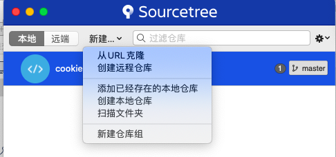

# Mac上Git下载与安装

## 下载安装包

 https://git-scm.com/download/mac

拖动安装

## 设置SSH Key

打开终端，设置秘钥

```
cd ~/.ssh
ssh-keygen -t rsa -C 506877354@qq.com
```

将SSH Key添加到代码库上

```
open ~/.ssh
```

拷贝id_rsa.pub中的文件内容至网站上保存

## SourceTree

Mac OS下没有TortoiseGit，使用SourceTree进行代码管理



